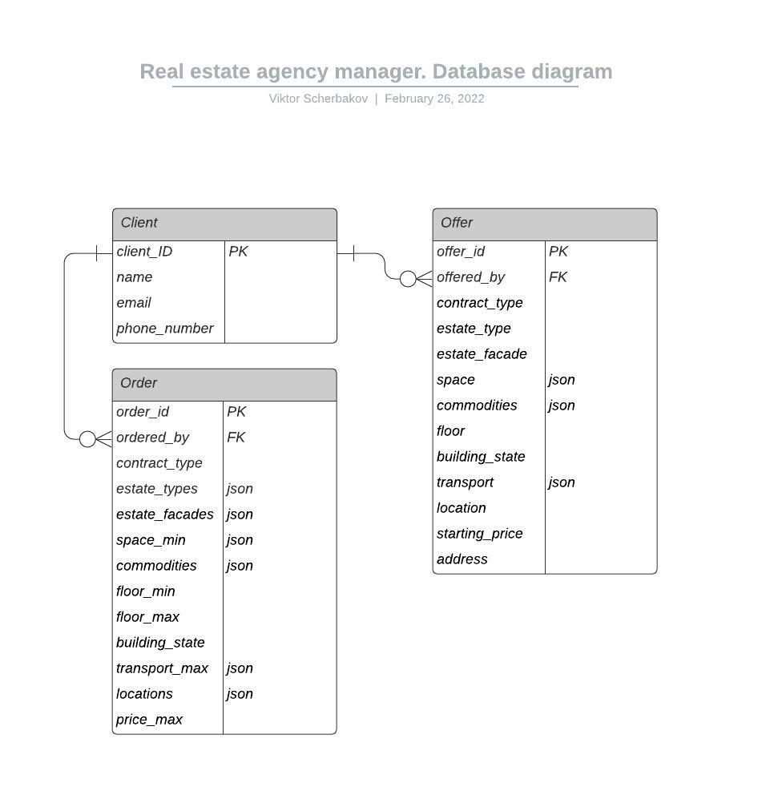

# Описание структуры базы данных

* `Client` Таблица клиентов агентства.
* `Order` Таблица заказов. Все значения либо принимают (возможно пустые) массивы или json-объекты, либо имеют возможность принимать `NULL` значение. Исключение - `order_id`, `ordered_by` и `contract_type` поля.
* `Offer` Таблица предложений. Все значения фиксированы, `NULL` значений нет.
